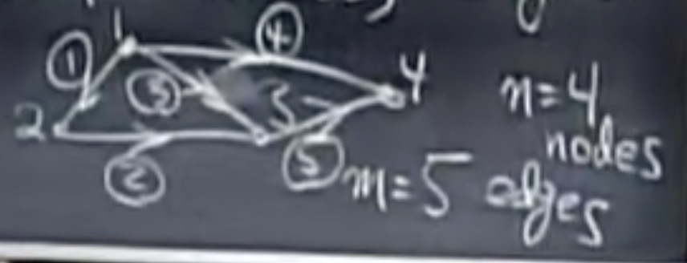
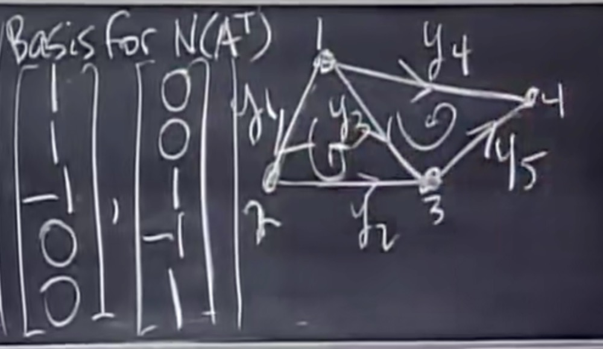

# 12.图和网络

## Graph

**Nodes, Edges**

- The relationship between nodes can be represented with a matrix form- A:

$$
A = \left[
\matrix{
-1&1&0&0\\
0&-1&1&0\\
-1&0&1&0\\
-1&0&0&1\\
0&0&-1&1
}
\right]
$$

(Rows represent edges, cols represent nodes)

### Ax = 0:

- From col space: **x_j** can represent the <u>potentials at the nodes</u>. Therefore, **Ax** can represent <u>potential difference</u>.

* To analyze from row space:
  $$
  Ax=\left[
  \matrix{
  x_2-x_1\\
  x_3-x_2\\
  x_3-x_1\\
  x_4-x_1\\
  x_4-x_3
  }
  \right]=
  \left[
  \matrix{
  0\\
  0\\
  0\\
  0\\
  0
  }
  \right]
  $$
  

- Therefore, **x = c*[1; 1; 1; 1]**, and **dim N(A) = 1**.
- rank = n - dim N(A) = 3

### A^T*y = 0

- $$
  A^Ty = \left[
  \matrix{
  -1&0&-1&-1&0\\
  1&-1&0&0&0\\
  0&1&1&0&-1\\
  0&0&0&1&1
  }
  \right]
  \left[
  \matrix{
  y_1\\
  y_2\\
  y_3\\
  y_4\\
  y_5
  }
  \right]=
  \left[
  \matrix{
  0\\
  0\\
  0\\
  0
  }
  \right]
  $$

  

- dim N(A^T) = m - r = 5 - 3 = 2 (inferring that <u>there are two loops</u>)

- **y_i** means currents on edges

- A^T*y = 0 is **<u>Kirchoff's Current Law</u>**

Considering the edges in the choosen loop, other edges' values are assigned to 0.

- <u>**e = Ax, y = Ce, and A^T*y = 0**</u>    -- > A^T * C * Ax = 0

### Euler's formula

* dim N(A^T) = m - r
  * (rank = n - 1)
  * **#loops = #edges - (#nodes - 1)**
  * Equivalently, <u>#loops + #nodes - #edges = 1</u>.

