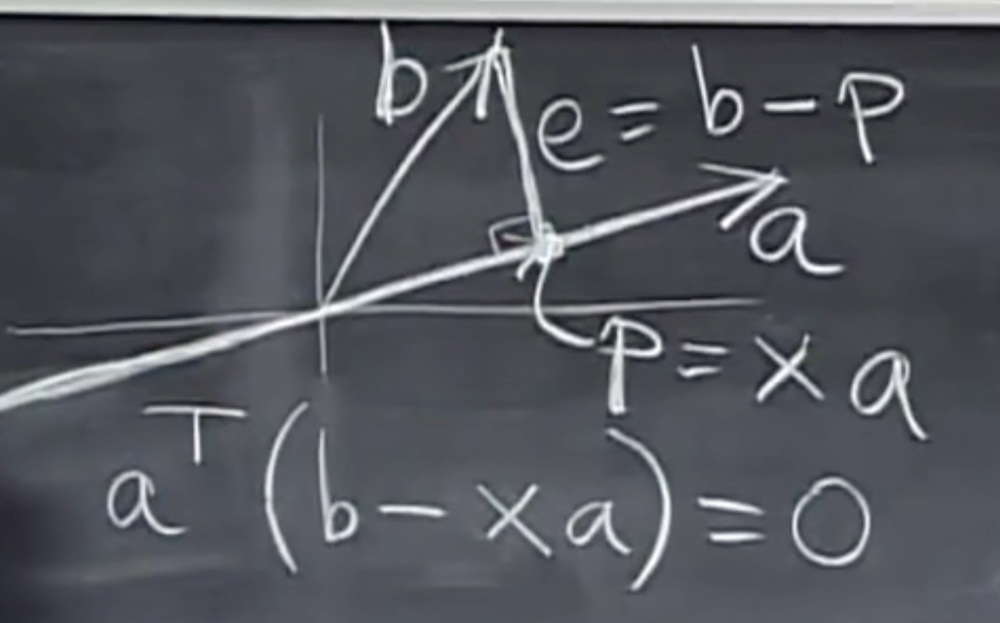
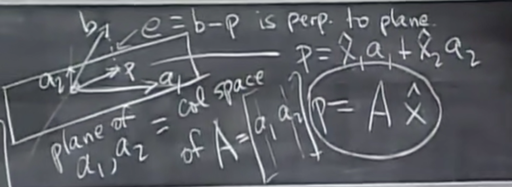
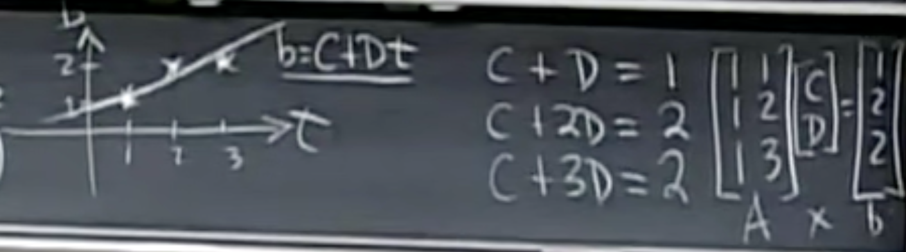

# 15.子空间投影

## Vector level:



* Let the projection of vector b on vector a as <u>p = ax</u>, because of orthogonality, we can get:

$$
a^T(b-ax) = 0
$$

* Therefore, we can get x:

$$
x=\frac{a^Tb}{a^Ta}
$$

* Then let projection matrix be

$$
P = \frac{aa^T}{a^Ta}
$$

​	then p = Pb.

<u>Two properties</u>:
$$
P^T=P\quad P^2=P
$$


## Matrix level:

#### Why project?

Because <u>Ax = b</u> may have no solution, we need a p (solve Ax^ = p) instead of b onto col space.



* Let the projection of vector b on space A as <u>p=Ax</u>, because of orthogonality, we can get:  
  $$
  A^T(b-Ax) = 0
  $$
  

- simplify it,
  $$
  \hat x = (A^TA)^{-1}A^Tb
  $$

- then let projection matrix 
  $$
  P=A(A^TA)^{-1}A^T
  $$

  * then p=Pb. **If A is a invertible square matrix**, obvirously b is in the column space of A, the projection p is the vector b it self, and the projection matrix.     (i.e. If b is in the column space of A, then p = Pb = b )
    $$
    P = A(A^TA)^{-1}A^T=A(A^{-1}(A^T)^{-1})A^T=I
    $$

  *  If b is perpendicular to the column space of A, then p=Pb=0. 

- The properties of projection matrix P:

  - rank(P) = 1
  - P^T = P, means P is symmetric
  - P^2 = P

## Application

list squared, fitting by a line.



We can solve this using MATLAB:

```matlab
A = [1 1;1 2;1 3];
b = [1;2;2];
x = inv(A'*A)*A'*b;
```

And the solution is 

    x =
    	0.6667
    	0.5000

