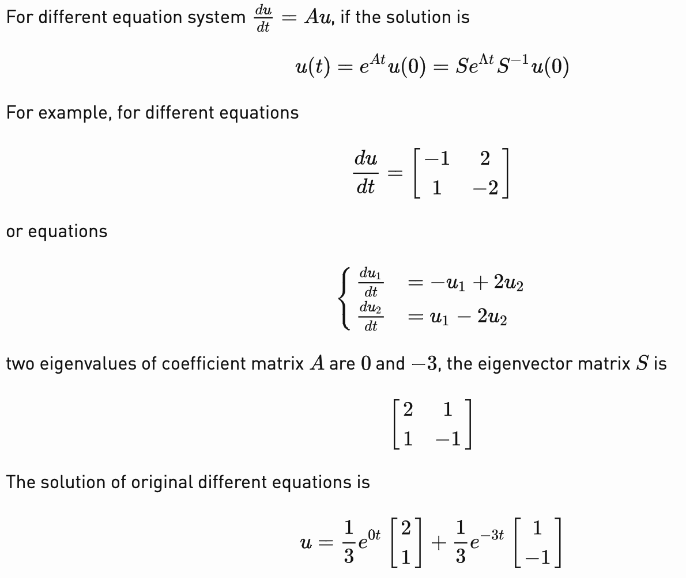
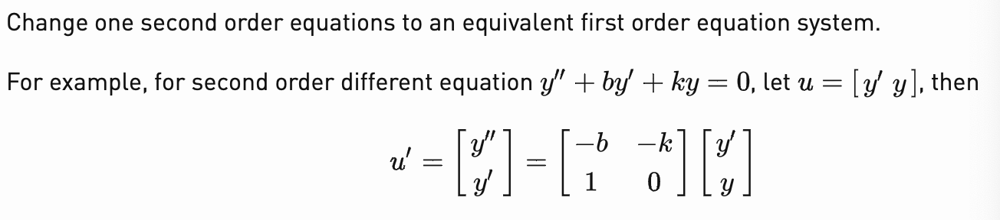

# 23.微分方程和exp(At)

1. **Matrix exponential**:

   * because
     $$
     e^x=1+x+\frac{x^2}{2}+\frac{x^3}{6}+...=\sum_{i=0}\frac{x^i}{i!}
     $$
     so for matrix 
     $$
     A=S^{-1}\Lambda S
     $$
     we have
     $$
     e^A=1+A+\frac{A^2}{2}+\frac{A^3}{6}+...\\
     =1+S\Lambda S^{-1}+S\Lambda^2S^{-1}+\frac{S\Lambda^3S^{-1}}{6}+...\\
     =Se^{\Lambda}S^{-1}
     $$

   * Similarly, we have:
     $$
     \frac{1}{I-A}=S\frac{1}{I-\Lambda}S^{-1}
     $$

   * Other forms......

2. 

3. 