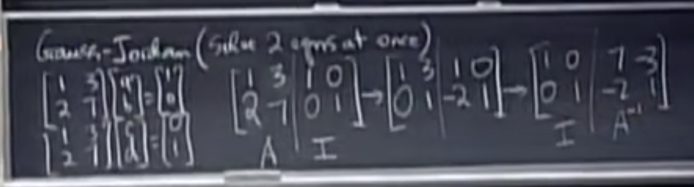

# 三、乘法和逆矩阵

$$
AB = C \\
so, C_{34} = A_{row3}·B_{col4} = \sum a_{3k}b_{k4}\\
(A^{m*n},\space B^{n*p},\space C^{m*p})
$$

There are three perspectives to solve matrix multiplication.

1. the common way
2. linear combinations of cols
3. linear combinations of rows

### invertible, non-singular 

$$
A^{-1}A = I = AA^{-1}
$$

- Singualr case: 
  - no inverse
  - its determinant == 0
  - linear correlation
  - if a vector X can be found, which satisfies AX = O ( X can't be O)

- To get A^-1 , we can use **Guass-Jordan** method (which can calculate two equ. at once.)

  
  $$
  E(A|I) = I|A^{-1} \\
  BUT\space HOW\space CAN\space WE\space KNOW\space THAT?\\
  Due\space to\space EA = I, thus\space E = A^{-1}\\
  And\space then,\space EI = E =A^{-1}
  $$

