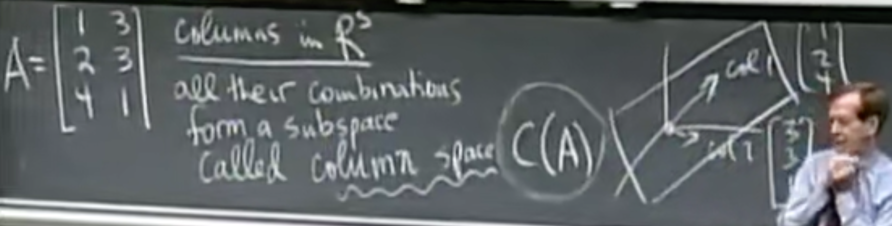

# 五、转置-置换-向量空间

​	In the previous study, we suppose that there is **no row exchange**. And finally we get the equation: **A = LU**

​	However, <u>if there exists some 0 in pivot position</u>, we need **permutations P**( = identity matrix with reordered rows). Consequently, the equation evolves: **PA = LU**.
$$
n!=n(n-1)...(3)(2)(1)
$$
counts reorderings 

counts all n*n permutations
$$
key:P^{-1}=P^{T}
$$

### Transpose:

$$
(A^{T})_{ij}=A_{ji}
$$

### Symmetric matrices:

$$
A^T = A\\for\space example:\space
\left[
\matrix{
3&1&2\\
1&5&6\\
2&6&7
}
\right]
$$

#### R'R is always symmetric:

$$
\left[
\matrix{
1&3\\
2&3\\
4&1
}
\right]
\left[
\matrix{
1&2&4\\
3&3&1\\
}
\right]
=
\left[
\matrix{
10&11&7\\
11&13&7\\
7&7&17
}
\right]
$$

WHY?
$$
To\space prove:\space (R^{T}R)^T = R^TR
$$

## Vector Spaces:

Examples: 
$$
R^2 = all\space 2-dim\space real\space vectors\\
=x-y\space pane\\
\left[
\matrix{
3\\2
}
\right]
,
\left[
\matrix{
0\\0
}
\right]
,
\left[
\matrix{
\pi\\e
}
\right]...
$$
And considering 3-dims condition......what about n-dims?

### subspaces

- **keypoint**: no matter you **Do any operations to any vector** in the subspace, the result would **never escape from this subspace**.

- lists **All subspaces of R^2**:
  - all of R^2
  - any line through [0; 0]     -> L
  - zero vector only                ->Z
- lists **All subspaces of R^3**:
  - all of R^3
  - any plane through [0; 0; 0]     -> P
  - any line through [0; 0; 0]     -> L
  - zero vector only                ->Z

