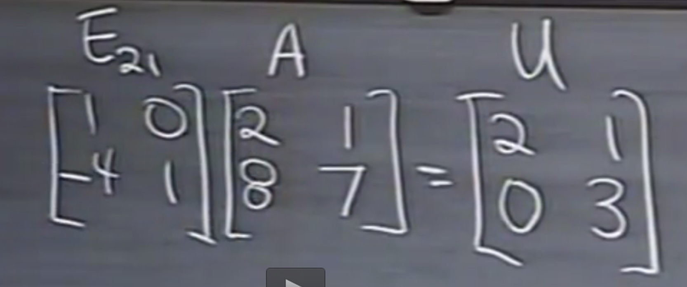
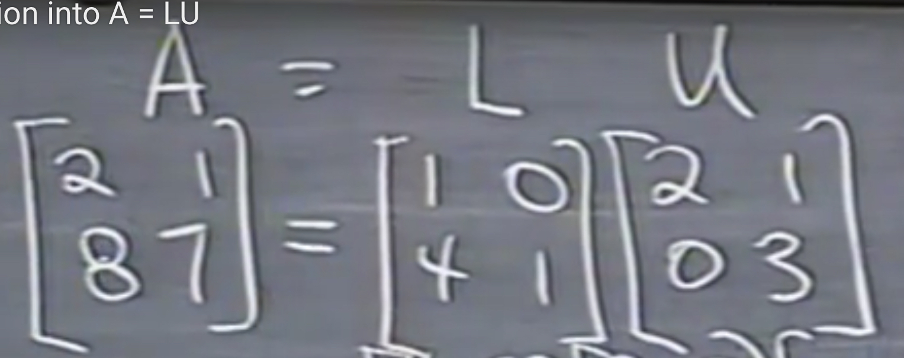
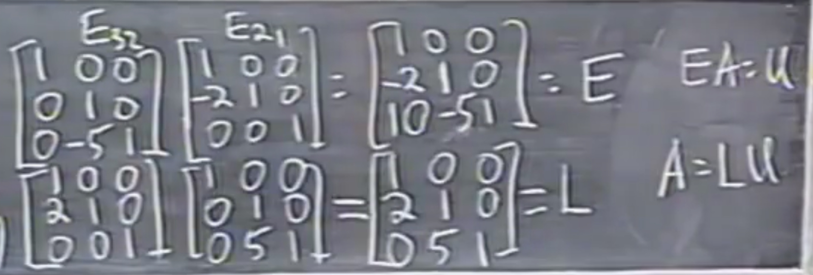

# 四、A的LU分解

- L is a lower triangular matrix, and U is a upper triangular matrix.

- 2 by 2 :

- 3 by 3 :

$$
E_{32}E_{31}E_{21}A=U\space (no\space row\space exchange)\\
A = E^{-1}_{21}E^{-1}_{31}E^{-1}_{32}U=LU\\
$$

​	example:

**meaning of LU decomposition**:

If we use Ax = b , the time complexity is O(n^3).

However, if we decompose A into LU, the time complexity will be O(n^2).

