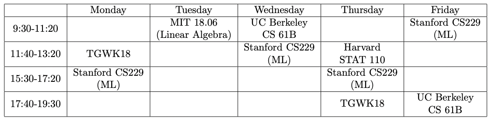

# 找同学一起刷UCB的CS61B的proj

- 找同学一起刷UCB的CS61B的proj，一起探讨进步～ 
- 还有在学习很多海外top cs课程，有兴趣的话，也可以一起来刷，后续也可以相互推荐其他好课一起刷。正在刷的课程还有：
  - Stanford CS229
  - Stanford CS231N
  - Harvard STAT110
  - MIT 18.06
  - UCB CS285
  - TGWK18
  

- 有兴趣的同学欢迎联系qq/vx：980803171
- 目前的课表是这样子：(实际学习会比课表多一些，学完了也会继续滚动更新～)

