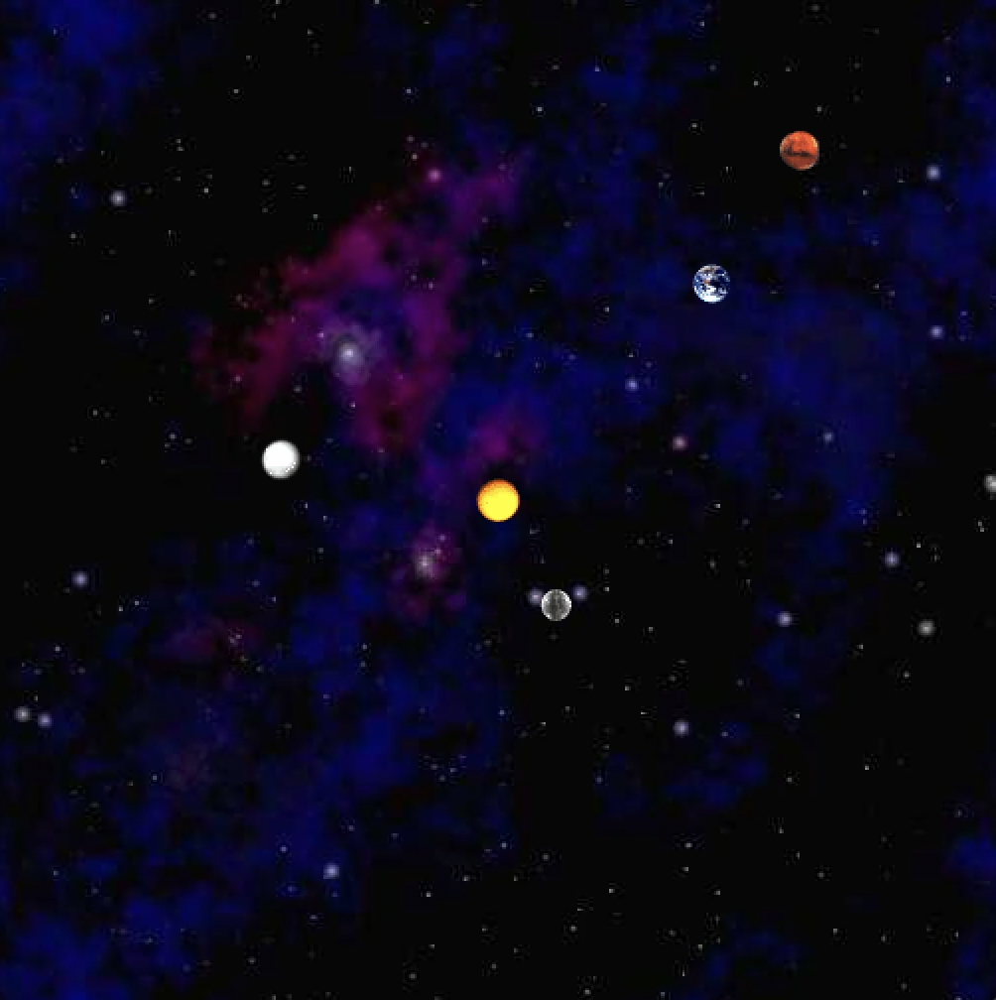
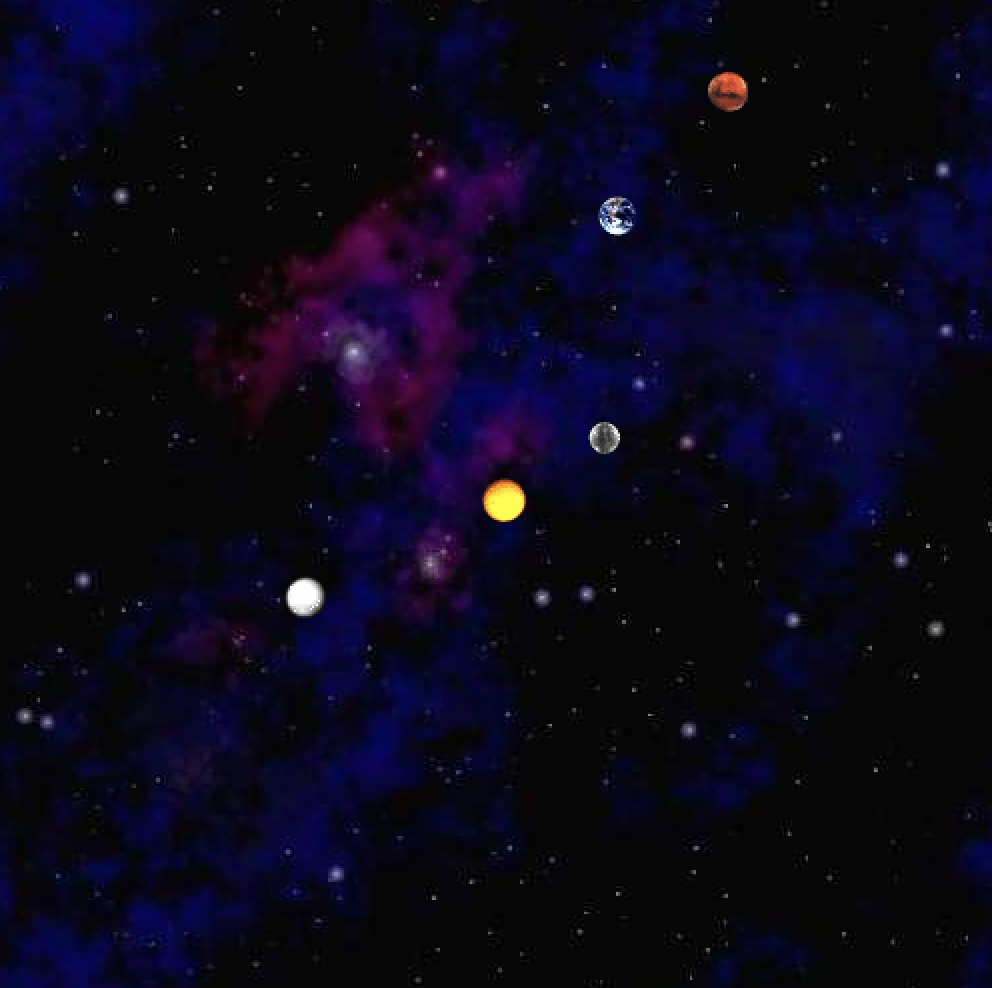
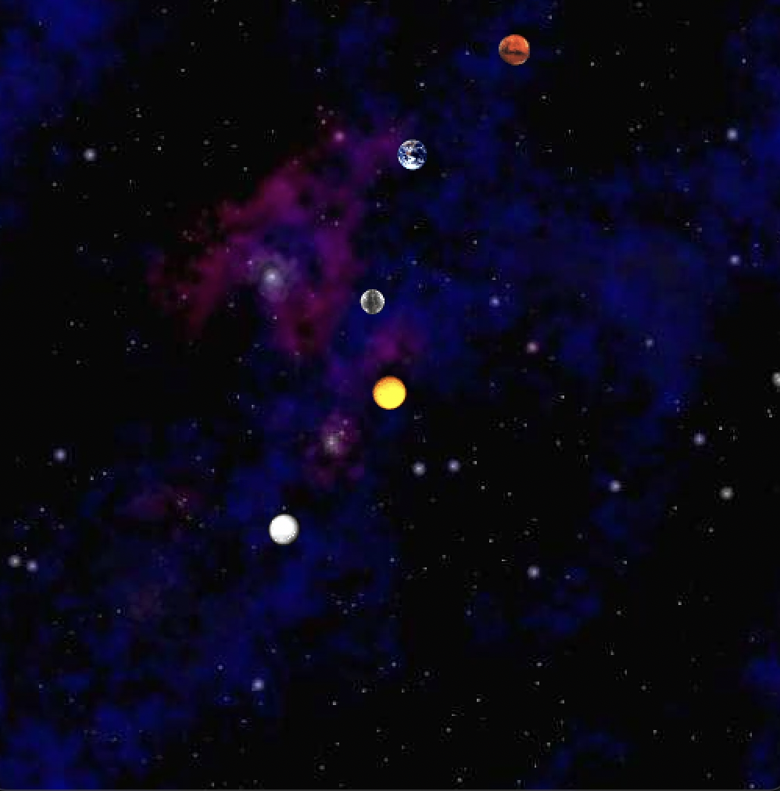

[Specific instructment by Josh Hug(I love him!) in CS61B:](https://sp18.datastructur.es/materials/proj/proj0/proj0)

- Get to know Object Oriented Programming. I created many objects(many planets). They all have five properties concerning their movement in the cosmos. 
- However, how to show the way they move?
  - Consider and then import **Newton's laws** in our method.
  - We need to compute indispensable parameters, like radius and focus between them.
  - Select two of planets, it is easy to compute the focus they are inflicted by others manually. Then we can compare it with the result our program bring us to vertify our program's correctness.
  - Choose more planets and **compute force**.
  - Use additive libs to **show their movement conditions as gif**. It require a update function, we need to **update their velocities and positions** (by m, F, a, v, etc.), and show these planets in different Time.
- Use <u>java NBody 157788000.0 25000.0 data/planets.txt</u> in command line to run.
- See the result:

- balabala......

[My code is there:](https://github.com/Willk1209/skeleton-sp18/tree/main/proj0)
