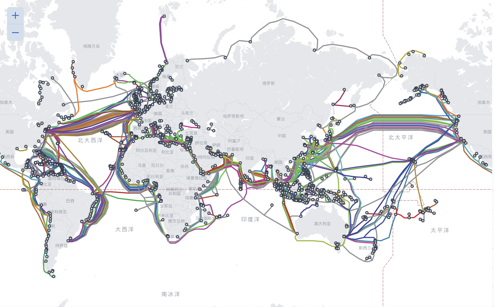

# 1.Introduction to the Internet

communicate, send message......

[This is the cable distribution in the world](https://www.submarinecablemap.com).

IP: Internet Protocol

each connected computer gets its own unique IP address.

- Version 4: 123.45.6.78

  - At most
    $$
    2^{32} \approx 4\times10^9addresses
    $$

* Version 6: 2001:0db8:0000:0042:0000:8a2e:0370:7334

  * At most
    $$
    2^{128}\approx10^{38}addresses
    $$

* Some standard services:
  * E-mail
    * SMTP, Simple Mail Transfer Protocol
  * File Sharing
    * FTP, File Transfer Protocol
  * World Wide Web
    * HTTP, HyperText Transfer Protocol
  * DNS
    * Domain Name System (UDP or TCP)

